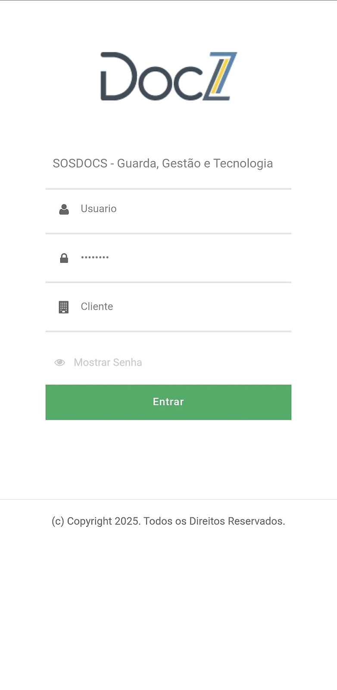

# App DocZ

O **DocZ Mobile** é o aplicativo utilizado para executar operações de gestão documental diretamente no campo ou no ambiente de armazenamento físico.

Ele permite que usuários realizem atividades como:

* consulta de documentos e caixas
* leitura de códigos de barras ou QR Codes
* movimentação de objetos
* criação de solicitações
* registro de localização
* acompanhamento de histórico e status documental

O aplicativo possui **interface otimizada para dispositivos móveis**, permitindo que as operações sejam realizadas por smartphones ou tablets durante atividades operacionais no acervo.

<figure><figcaption></figcaption></figure>

### Ações e funcionalidades no aplicativo DocZ:

<strong>Acesso ao Aplicativo</strong>

O acesso ao aplicativo ocorre por meio da **tela de autenticação**, onde o usuário deve informar suas credenciais para iniciar a sessão no sistema.


**Importante:**\
As credenciais utilizadas no aplicativo são **as mesmas da aplicação web do DocZ**. Portanto, **não é necessário criar um novo usuário ou senha para utilizar o aplicativo**.


#### Fluxo de acesso

1. O usuário informa **Usuário, Senha e Cliente**.
2. O sistema realiza a validação das credenciais informadas.
3. Caso os dados estejam corretos, o sistema direciona o usuário para a **tela de seleção de projetos disponíveis**.
4. Caso haja erro na autenticação, o sistema exibe uma **mensagem de alerta** e permanece na tela de login para que o usuário realize uma nova tentativa.

<strong>Seleção de Projeto</strong>

Após o login, o usuário visualiza os **projetos disponíveis para seu perfil de acesso**.

A lista apresentada é definida com base em dois critérios:

* **Cliente informado no login**
* **Perfil de acesso do usuário**

Esse mecanismo garante o **isolamento de dados entre clientes (multi-tenant)** e restringe o acesso apenas aos projetos autorizados.&#x20;

<figure><figcaption></figcaption></figure>

Após selecionar o projeto, o usuário é direcionado para o **Menu Principal do aplicativo**.

<strong>Menu Principal</strong>

O **Menu Principal** concentra as principais funcionalidades operacionais do aplicativo.

<figure><figcaption></figcaption></figure>

**Menu Lateral de Navegação**

O menu lateral permite acesso rápido às funcionalidades completas do sistema.

_Ao selecionar uma opção, o sistema carrega automaticamente a tela correspondente._

***

O rodapé da tela exibe:

* projeto ativo
* usuário logado

Isso garante a **identificação do contexto operacional da sessão**.&#x20;

<strong>Consulta de Objetos</strong>

A funcionalidade **Consulta de Objeto** permite localizar caixas ou documentos dentro do projeto ativo.

Por meio dessa funcionalidade, o usuário pode acessar informações detalhadas do objeto, visualizar seu histórico de movimentações e realizar determinadas ações operacionais.

#### Métodos de consulta

O sistema permite três formas de entrada de dados:

<table data-view="cards"><thead><tr><th></th></tr></thead><tbody><tr><td><strong>Scan:</strong> Captura do código do objeto utilizando a câmera do dispositivo.</td></tr><tr><td><strong>Leitor:</strong> Leitura do código por meio de scanner ou leitor externo.</td></tr><tr><td><strong>Texto:</strong> Digitação manual do código identificador do objeto.</td></tr></tbody></table>

Após a leitura ou digitação, o sistema processa a consulta e apresenta as informações do objeto localizado.

#### Visualização de Detalhes do Objeto

Após a realização da consulta, o sistema apresenta a tela de **detalhes do objeto**, contendo as principais informações cadastradas no sistema.

<figure><figcaption></figcaption></figure>

A partir dessa tela, o usuário também pode acessar funcionalidades adicionais relacionadas ao objeto consultado.

**Fluxo da tela:**

Consulta de Objeto ➡️ Visualização do objeto ➡️ Histórico / Expurgo / Nova consulta

\

#### ↘️ Ações disponíveis:


**Consulta Contínua:** O usuário pode realizar uma nova busca de objeto diretamente pelos botões superiores sem precisar sair da tela de histórico.


<table data-card-size="large" data-view="cards"><thead><tr><th></th></tr></thead><tbody><tr><td>

<h4>Histórico do Objeto</h4>
A funcionalidade <strong>Histórico do Objeto</strong> apresenta o registro completo das movimentações e alterações realizadas no item ao longo do tempo.

Cada registro do histórico contém:
<ul><li><strong>Data e hora</strong> da ocorrência</li><li><strong>Tipo de evento</strong> registrado</li><li><strong>Usuário ou sistema responsável pela ação</strong></li></ul>
Esse recurso permite acompanhar o <strong>ciclo de vida documental do objeto.</strong>
</td></tr><tr><td>

<h4>Expurgo do Objeto</h4>
O <strong>expurgo</strong> representa o descarte definitivo do objeto no sistema, indicando que o item atingiu o fim de seu ciclo de vida documental.

<strong>Ações disponíveis:</strong>
<ul><li><strong>Cancelar:</strong> fecha a janela e retorna à consulta do objeto sem alterações.</li><li><strong>Confirmação de Sucesso: a</strong>pós a confirmação, o sistema exibe a mensagem <strong>“Expurgo solicitado com sucesso”</strong>.</li></ul>

A operação é registrada no <strong>histórico do objeto.</strong> 
</td></tr></tbody></table>

<strong>Consulta de Conteúdo de Container</strong>

Essa funcionalidade permite visualizar todos os **documentos ou objetos armazenados em um container específico**.

<figure><figcaption></figcaption></figure>

Após informar o código do container, o sistema apresenta a listagem de itens vinculados à unidade de armazenamento.

#### Métodos de consulta

O sistema permite três formas de entrada de dados:

<table data-view="cards"><thead><tr><th></th></tr></thead><tbody><tr><td><strong>Scan:</strong> Captura do código do objeto utilizando a câmera do dispositivo.</td></tr><tr><td><strong>Leitor:</strong> Leitura do código por meio de scanner ou leitor externo.</td></tr><tr><td><strong>Texto:</strong> Digitação manual do código identificador do objeto.</td></tr></tbody></table>

Após a consulta, o sistema apresenta a **lista de objetos vinculados ao container**.

Cada item pode ser selecionado para **visualização detalhada**.

<figure><figcaption></figcaption></figure>

#### Detalhes do Objeto

Ao selecionar um item da lista e clicar em , o sistema exibe um **modal com as informações completas do objeto**.

Entre os dados apresentados estão:

<table data-header-hidden><thead><tr><th width="88"></th><th></th><th width="134.666748046875"></th><th width="80"></th><th width="120"></th><th></th></tr></thead><tbody><tr><td>Assunto</td><td>Classificação</td><td>Departamento</td><td>ID SOS</td><td>Localização</td><td>Status do documento</td></tr></tbody></table>

<figure><figcaption></figcaption></figure>

Essas informações permitem a **conferência detalhada do registro e sua rastreabilidade no sistema**.

<strong>Solicitações (Ordens de Serviço)</strong>

A funcionalidade **Solicitações** permite criar e acompanhar **Ordens de Serviço (O.S)** relacionadas à movimentação de documentos ou caixas no acervo.

<figure><figcaption></figcaption></figure>

#### ↘️ Ações disponíveis:

| <mark style="color:green;">Nova O.S de Empréstimo</mark> | <mark style="color:green;">Nova O.S de Devolução</mark> | <mark style="color:green;">Nova O.S de Implantação</mark> |
| -------------------------------------------------------- | ------------------------------------------------------- | --------------------------------------------------------- |

Também é possível acompanhar as solicitações já criadas por meio da **tabela de O.S**, que apresenta:

| Número da solicitação | Tipo de serviço | Status da solicitação |
| --------------------- | --------------- | --------------------- |

#### 🔖 Como solicitar no APP?

1. O usuário seleciona o tipo de **Nova O.S** desejado.
2. O sistema cria a solicitação e exibe uma **mensagem de confirmação** com o número da O.S gerada.
3. Após confirmar o alerta, o usuário deve **adicionar os itens (documentos, caixas ou lotes)** à solicitação.
4. Em seguida, a solicitação pode ser **confirmada e enviada para atendimento**.


As solicitações possuem **status de acompanhamento**, como por exemplo:

* **ABERTA**
* **EM ATENDIMENTO**

Esses status permitem acompanhar o andamento da solicitação dentro do sistema.


<strong>Arquivamento em Container</strong>

Essa funcionalidade permite **associar documentos ou objetos a um container**, como caixas, paletes ou lotes, garantindo a rastreabilidade do arquivamento.

<figure><figcaption></figcaption></figure>

#### Fluxo de arquivamento

1. Informar o **container principal** (unidade de destino).
2. Informar o(s) **objeto(s)** que serão armazenados no container.
3. Confirmar novamente o **container principal** para finalizar a operação.

Os itens processados são exibidos em uma **tabela de conferência**, indicando o objeto e sua localização.


O sistema exibe o **total de itens processados**, permitindo que o usuário acompanhe o arquivamento e evite erros de conferência.


Atribuição de Localização

<figure><figcaption></figcaption></figure>

Status de Gestão Documental

<figure><figcaption></figcaption></figure>

<a href="../" class="button secondary" data-icon="circle-left">Voltar</a>
