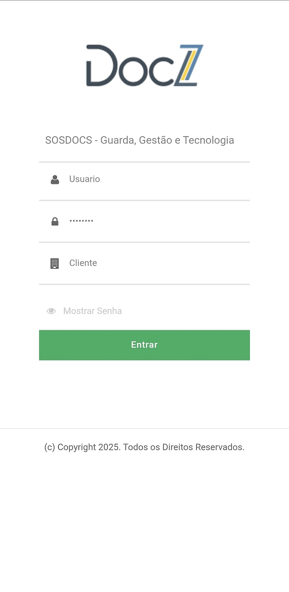

---
layout:
  width: default
  title:
    visible: true
  description:
    visible: false
  tableOfContents:
    visible: true
  outline:
    visible: true
  pagination:
    visible: true
  metadata:
    visible: true
  tags:
    visible: true
  actions:
    visible: true
  anchors:
    visible: true
---

# App DocZ

O **DocZ Mobile** é o aplicativo utilizado para executar operações de gestão documental diretamente no campo ou no ambiente de armazenamento físico.

Ele permite que usuários realizem atividades como:

* consulta de documentos e caixas
* leitura de códigos de barras ou QR Codes
* movimentação de objetos
* criação de solicitações
* registro de localização
* acompanhamento de histórico e status documental

O aplicativo possui **interface otimizada para dispositivos móveis**, permitindo que as operações sejam realizadas por smartphones ou tablets durante atividades operacionais no acervo.

<figure><figcaption></figcaption></figure>

### Ações e funcionalidades no aplicativo DocZ:

<strong>Acesso ao Aplicativo</strong>

O acesso ao aplicativo ocorre por meio da **tela de autenticação**, onde o usuário deve informar suas credenciais para iniciar a sessão no sistema.


**Importante:**\
As credenciais utilizadas no aplicativo são **as mesmas da aplicação web do DocZ**. Portanto, **não é necessário criar um novo usuário ou senha para utilizar o aplicativo**.


#### Fluxo de acesso

1. O usuário informa **Usuário, Senha e Cliente**.
2. O sistema realiza a validação das credenciais informadas.
3. Caso os dados estejam corretos, o sistema direciona o usuário para a **tela de seleção de projetos disponíveis**.
4. Caso haja erro na autenticação, o sistema exibe uma **mensagem de alerta** e permanece na tela de login para que o usuário realize uma nova tentativa.

<strong>Seleção de Projeto</strong>

Após o login, o usuário visualiza os **projetos disponíveis para seu perfil de acesso**.

A lista apresentada é definida com base em dois critérios:

* **Cliente informado no login**
* **Perfil de acesso do usuário**

Esse mecanismo garante o **isolamento de dados entre clientes (multi-tenant)** e restringe o acesso apenas aos projetos autorizados.&#x20;

<figure><figcaption></figcaption></figure>

Após selecionar o projeto, o usuário é direcionado para o **Menu Principal do aplicativo**.

### **Menu Lateral de Navegação**

O **Menu Principal** concentra as principais funcionalidades operacionais do aplicativo.

O menu lateral permite acesso rápido às funcionalidades completas do sistema.

_Ao selecionar uma opção, o sistema carrega automaticamente a tela correspondente._

<figure><figcaption></figcaption></figure>

<strong>Arquivar Caixa</strong>

Essa funcionalidade permite **associar caixas ou objetos a um container**, como caixas, paletes ou lotes, garantindo a rastreabilidade do arquivamento.

**Fluxo de arquivamento**

1. Informar o **container principal** (unidade de destino).
2. Informar o(s) **objeto(s)** que serão armazenados no container.
3. Confirmar novamente o **container principal** para finalizar a operação.

Os itens processados são exibidos em uma **tabela de conferência**, indicando o objeto e sua localização.

O sistema exibe o **total de itens processados**, permitindo que o usuário acompanhe o arquivamento e evite erros de conferência.

<strong>Importar Legado</strong>

<figure><figcaption></figcaption></figure>

<strong>Arquivar documento</strong>

Essa funcionalidade permite **associar documentos ou objetos a um container**, como caixas, paletes ou lotes, garantindo a rastreabilidade do arquivamento.

**Fluxo de arquivamento**

1. Informar o **container principal** (unidade de destino).
2. Informar o(s) **objeto(s)** que serão armazenados no container.
3. Confirmar novamente o **container principal** para finalizar a operação.

Os itens processados são exibidos em uma **tabela de conferência**, indicando o objeto e sua localização.

O sistema exibe o **total de itens processados**, permitindo que o usuário acompanhe o arquivamento e evite erros de conferência.

<strong>Auditoria de O.S</strong>

<figure><figcaption></figcaption></figure>

<mark style="color:$tint;"><strong>Fotolabel do Espelho da Caixa</strong></mark>

A funcionalidade **Fotolabel do Espelho da Caixa** permite fotografar os espelhos das caixas de um pallet de forma sequencial e enviar as imagens ao DocZ ao final da operação.

<figure><figcaption></figcaption></figure>

### Como utilizar

1. Acesse **Fotolabel do Espelho da Caixa** no aplicativo.
2. Selecione **Leitor** para realizar a leitura das etiquetas. A leitura pode ser feita pelo aparelho ou pela câmera do celular/tablet, conforme a operação.
3. Faça a leitura da **etiqueta do pallet**, que identifica as caixas vinculadas a ele.\
   .png>)
4. Faça a leitura da **primeira caixa**. A câmera do dispositivo será aberta automaticamente.\
   .png>)
5. **Fotografe o espelho da caixa**.\
   .png>)
6. Repita a leitura e a fotografia para cada caixa do pallet.\
   .png>)
7. Após concluir todas as caixas, selecione **Enviar** para encaminhar as imagens ao DocZ.\
   .png>)

> **Importante:** realize o procedimento para todas as caixas do pallet antes de selecionar **Enviar**.

<mark style="color:$tint;"><strong>Fotolabel com Indexação Automática</strong></mark>

A funcionalidade **Fotolabel com Indexação Automática** permite realizar a captura do espelho da Caixa e prepará-lo automaticamente para processamento pelo Docfy.

Diferentemente do **Fotolabel do Espelho da Caixa**, que realiza a captura do espelho, esta funcionalidade integra a captura ao fluxo de processamento e indexação automática, reduzindo a necessidade de intervenções manuais.

### Acesso à funcionalidade

No aplicativo Android DocZ, acesse:

**Menu > Fotolabel com Indexação Automática**

A funcionalidade apresenta ao usuário as três etapas necessárias para execução:

1. **Informe a Localização**;
2. **Informe a Caixa**;
3. **Tire Foto do Espelho da Caixa**.

O fluxo deve ser executado nessa ordem.

### Como utilizar:

Após acessar a funcionalidade, siga as etapas apresentadas pelo aplicativo:

<figure><figcaption></figcaption></figure>

**1. Informe a Localização**

Informe a localização correspondente ao local onde a Caixa está armazenada.

**2. Informe a Caixa**

Realize a leitura das informações solicitadas até que a Caixa seja identificada pelo sistema.

A identificação correta da Caixa é necessária para que o espelho seja associado ao objeto documental correspondente.

**3. Tire a Foto do Espelho da Caixa**

Após a identificação da Caixa, realize a captura do **espelho da Caixa** pelo aplicativo.

O aplicativo realiza o upload da imagem para o DocZ.

**4. Processamento automático**

Após a conclusão das etapas e do upload da imagem, o sistema realiza automaticamente a preparação da Caixa para processamento pelo Docfy.

O **Status da Gestão Documental** da Caixa é alterado automaticamente para:

<kbd>**DISPONIVEL PARA DOCFY**</kbd>

<figure><figcaption></figcaption></figure>

Na sequência, o espelho da Caixa é encaminhado automaticamente ao Docfy para processamento OCR e indexação dos campos.

Dessa forma, o usuário **não precisa realizar manualmente a alteração do Status nem o envio do espelho ao Docfy**.

<figure><figcaption>
Exemplo da integração
</figcaption></figure>


### **Atenção**

O funcionamento da **Fotolabel com Indexação Automática** depende de regras específicas do projeto. Observe as orientações abaixo para evitar interrupções ou processamento incorreto.


### Regras negociais importantes

<table data-header-hidden><thead><tr><th width="242"></th><th></th></tr></thead><tbody><tr><td>1. O Status é obrigatório</td><td>
O projeto deve possuir previamente cadastrado o Status:

<strong>DISPONIVEL PARA DOCFY</strong>

Esse Status deve estar configurado no domínio <strong>StatusGestaoDocumental</strong> do projeto.

<a href="https://sosdocs.atlassian.net/servicedesk/customer/portal/16"><em><mark style="color:blue;">A configuração é realizada previamente pelo</mark><mark style="color:blue;"> </mark><mark style="color:blue;"><strong>Suporte durante a configuração do Projeto</strong></mark><mark style="color:blue;">.</mark></em></a>
</td></tr><tr><td>2. O Status <mark style="color:$danger;">não</mark> deve ser alterado pelo usuário</td><td>
O valor <strong>DISPONIVEL PARA DOCFY</strong> é fixo para essa funcionalidade.

O Status não é definido pelo usuário durante a execução do Fotolabel e não deve ser substituído por outro Status para tentar realizar o processamento.
</td></tr><tr><td>3. O sistema valida o Status antes de prosseguir</td><td>
Antes de alterar o Status da Caixa e encaminhar o espelho ao Docfy, o sistema verifica se <strong>DISPONIVEL PARA DOCFY</strong> está cadastrado no projeto.

Caso o Status não esteja configurado, o processamento é interrompido.

O sistema exibirá a mensagem:

<strong>“O status “DISPONIVEL PARA DOCFY” não está configurado para este projeto. Entre em contato com o suporte para realizar a configuração.”</strong>

<mark style="color:blue;">Nessa situação, <strong>não é necessário repetir o procedimento</strong>.</mark> <a href="https://sosdocs.atlassian.net/servicedesk/customer/portal/16"><mark style="color:blue;">O usuário deve entrar em contato com o Suporte para realizar a configuração necessária no projeto.</mark></a>
</td></tr><tr><td>4. O envio ao Docfy ocorre automaticamente</td><td>
Depois que a imagem é enviada ao DocZ e o Status é alterado para <strong>DISPONIVEL PARA DOCFY</strong>, o espelho da Caixa é encaminhado automaticamente ao Docfy.

Portanto, <strong>não é necessário realizar um segundo envio manual do espelho para o processamento</strong>.
</td></tr><tr><td>5. A alteração do Status também é automática</td><td>
Ao concluir corretamente o fluxo, o sistema altera automaticamente o Status da Gestão Documental da Caixa.

O usuário não precisa realizar essa alteração manualmente.
</td></tr><tr><td>6. A execução deve seguir o fluxo apresentado pelo aplicativo</td><td>
A funcionalidade foi definida para seguir a sequência:

<strong>Localização → Caixa → Foto do Espelho → Alteração automática do Status → Envio ao Docfy → Processamento/Indexação</strong>

O usuário deve concluir as etapas apresentadas pelo aplicativo para que o processamento automático seja iniciado.
</td></tr><tr><td>7. As ações ficam registradas na Trilha de Auditoria</td><td>
As principais ações realizadas pela funcionalidade são registradas na <strong>Trilha de Auditoria</strong>, incluindo:
<ul><li>alteração automática do Status da Gestão Documental para <strong>DISPONIVEL PARA DOCFY</strong>;</li><li>inserção do Fotolabel e envio automático do espelho ao Docfy;</li><li>tentativa de inserção do Fotolabel quando o Status obrigatório não estiver configurado.</li></ul></td></tr></tbody></table>


**Em caso de dúvidas, erros ou necessidade de implementação da funcionalidade,** [**clique aqui para acionar o Suporte da SOSDocs.**](https://sosdocs.atlassian.net/servicedesk/customer/portal/16)


<mark style="color:$tint;"><strong>Consultar Objeto</strong></mark>

A funcionalidade **Consulta de Objeto** permite localizar caixas ou documentos dentro do projeto ativo.

Por meio dessa funcionalidade, o usuário pode acessar informações detalhadas do objeto, visualizar seu histórico de movimentações e realizar determinadas ações operacionais.

#### **Métodos de consulta**

O sistema permite três formas de entrada de dados:

<table data-view="cards"><thead><tr><th></th></tr></thead><tbody><tr><td><strong>Scan:</strong> Captura do código do objeto utilizando a câmera do dispositivo.</td></tr><tr><td><strong>Leitor:</strong> Leitura do código por meio de scanner ou leitor externo.</td></tr><tr><td><strong>Texto:</strong> Digitação manual do código identificador do objeto.</td></tr></tbody></table>

Após a leitura ou digitação, o sistema processa a consulta e apresenta as informações do objeto localizado.

#### **Visualização de Detalhes do Objeto**

Após a realização da consulta, o sistema apresenta a tela de **detalhes do objeto**, contendo as principais informações cadastradas no sistema.

<figure><figcaption></figcaption></figure>

A partir dessa tela, o usuário também pode acessar funcionalidades adicionais relacionadas ao objeto consultado.

**Fluxo da tela:**

Consulta de Objeto ➡️ Visualização do objeto ➡️ Histórico / Expurgo / Nova consulta

#### **↘️ Ações disponíveis:**


**Consulta Contínua:** O usuário pode realizar uma nova busca de objeto diretamente pelos botões superiores sem precisar sair da tela de histórico.


<table data-card-size="large" data-view="cards"><thead><tr><th></th></tr></thead><tbody><tr><td>

<strong>Histórico do Objeto</strong>

A funcionalidade <strong>Histórico do Objeto</strong> apresenta o registro completo das movimentações e alterações realizadas no item ao longo do tempo.

Cada registro do histórico contém:
<ul><li><strong>Data e hora</strong> da ocorrência</li><li><strong>Tipo de evento</strong> registrado</li><li><strong>Usuário ou sistema responsável pela ação</strong></li></ul>
Esse recurso permite acompanhar o <strong>ciclo de vida documental do objeto.</strong>
</td></tr><tr><td>

<strong>Expurgo do Objeto</strong>

O <strong>expurgo</strong> representa o descarte definitivo do objeto no sistema, indicando que o item atingiu o fim de seu ciclo de vida documental.

<strong>Ações disponíveis:</strong>
<ul><li><strong>Cancelar:</strong> fecha a janela e retorna à consulta do objeto sem alterações.</li><li><strong>Confirmação de Sucesso: a</strong>pós a confirmação, o sistema exibe a mensagem <strong>“Expurgo solicitado com sucesso”</strong>.</li></ul>
A operação é registrada no <strong>histórico do objeto.</strong>
</td></tr></tbody></table>

<mark style="color:$tint;"><strong>Consultar Conteúdo</strong></mark>

Essa funcionalidade permite visualizar todos os **documentos ou objetos armazenados em um container específico**.

Após informar o código do container, o sistema apresenta a listagem de itens vinculados à unidade de armazenamento.

**Métodos de consulta**

O sistema permite três formas de entrada de dados:

<table data-view="cards"><thead><tr><th></th></tr></thead><tbody><tr><td><strong>Scan:</strong> Captura do código do objeto utilizando a câmera do dispositivo.</td></tr><tr><td><strong>Leitor:</strong> Leitura do código por meio de scanner ou leitor externo.</td></tr><tr><td><strong>Texto:</strong> Digitação manual do código identificador do objeto.</td></tr></tbody></table>

Após a consulta, o sistema apresenta a **lista de objetos vinculados ao container**.

Cada item pode ser selecionado para **visualização detalhada**.

<figure><figcaption></figcaption></figure>

**Detalhes do Objeto**

Ao selecionar um item da lista e clicar em .png>) , o sistema exibe um **modal com as informações completas do objeto**.

Entre os dados apresentados estão:

<table data-header-hidden><thead><tr><th width="88"></th><th></th><th width="135"></th><th width="77"></th><th width="117"></th><th></th></tr></thead><tbody><tr><td>Assunto</td><td>Classificação</td><td>Departamento</td><td>ID SOS</td><td>Localização</td><td>Status do documento</td></tr></tbody></table>

Essas informações permitem a **conferência detalhada do registro e sua rastreabilidade no sistema**.

<a href="../" class="button secondary" data-icon="circle-left">Voltar</a>
