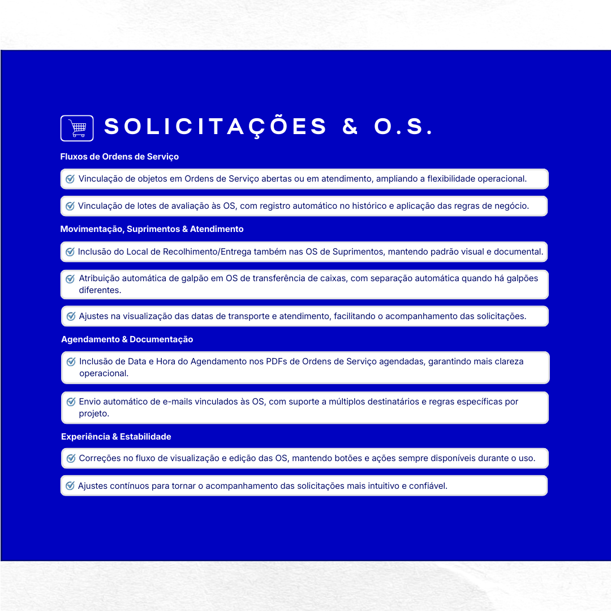
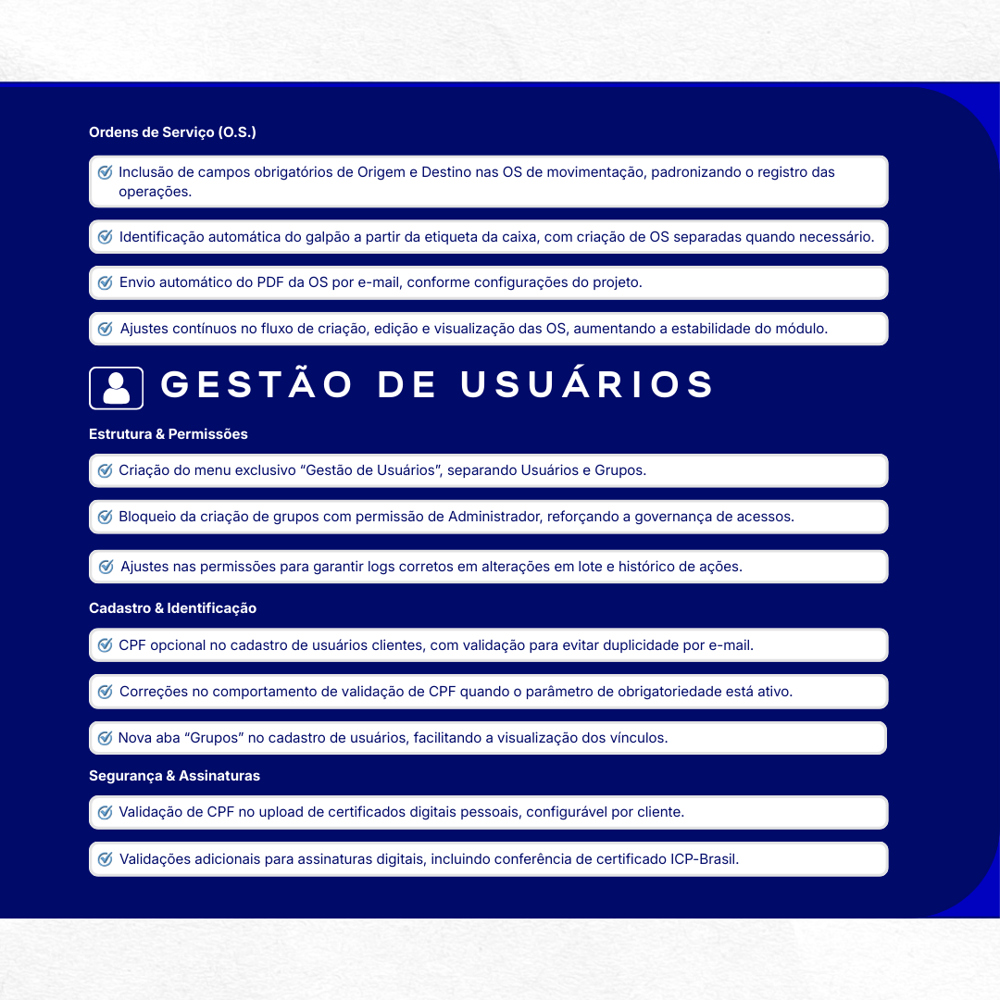
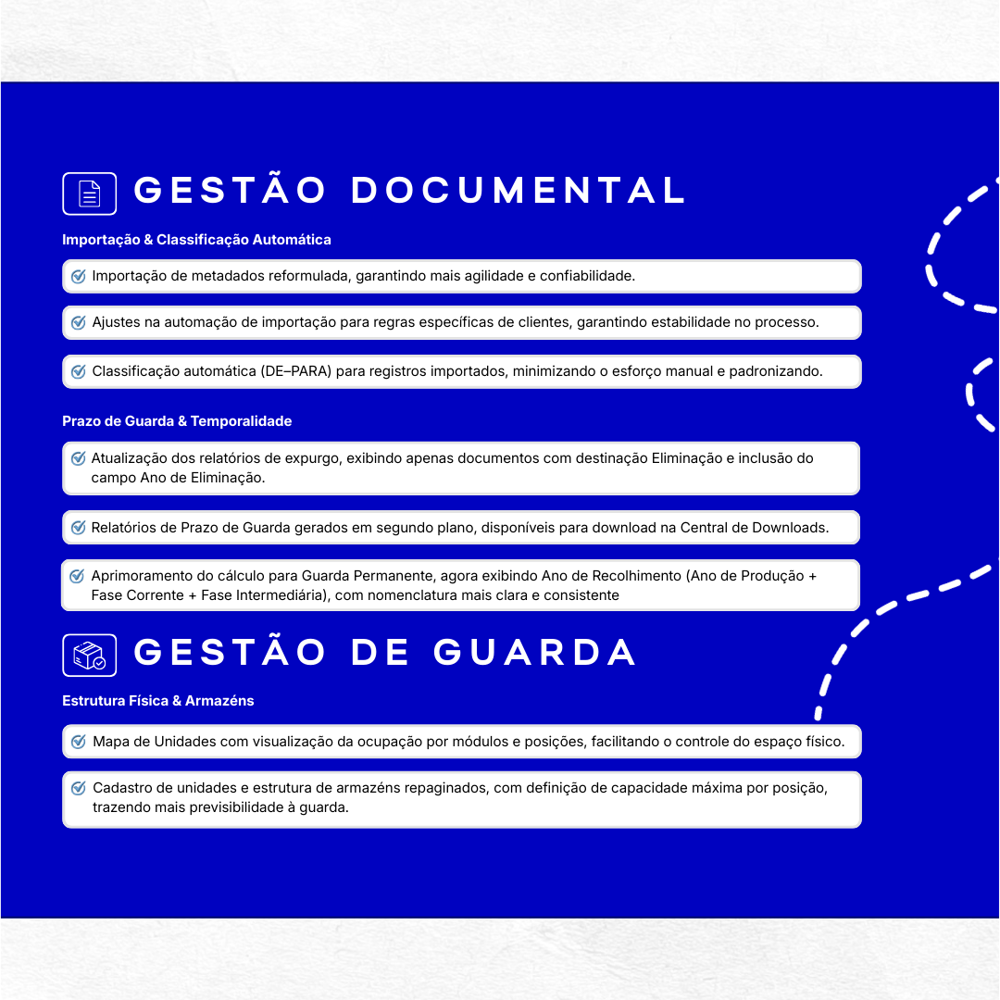
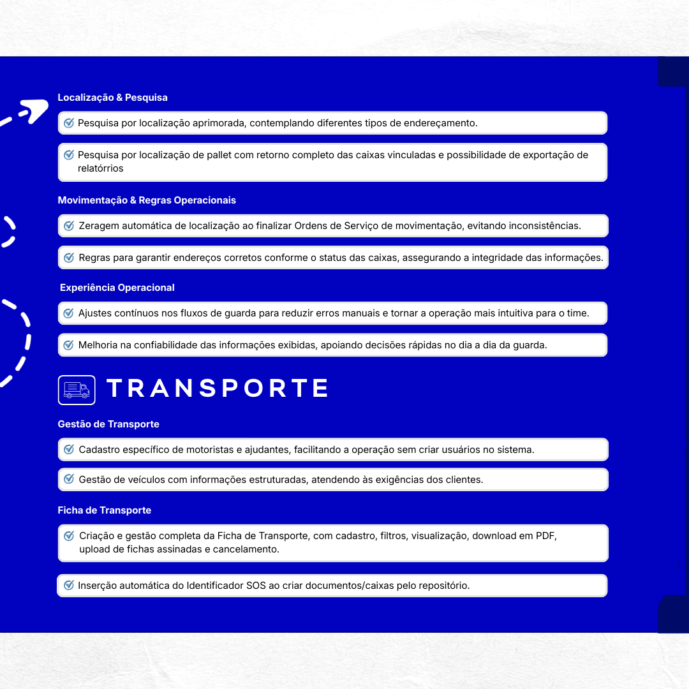
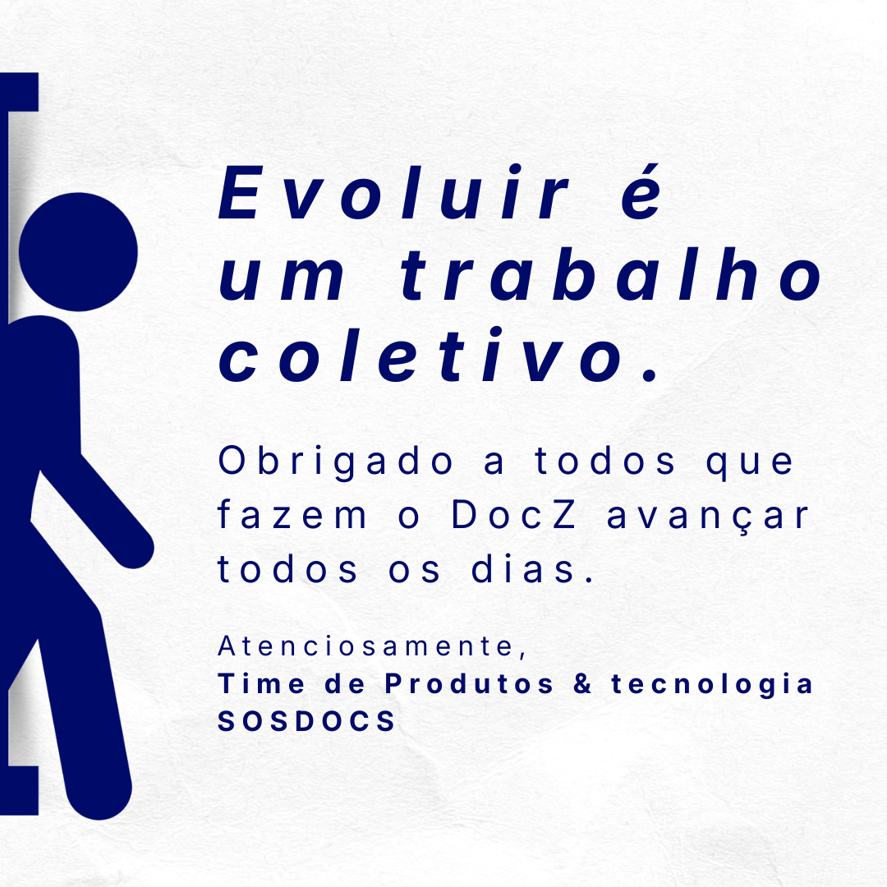

# Resumo

### 🔑 Viramos a chave da evolução.

Virar a chave da evolução não é apenas lançar versões.

É transformar a forma como a operação funciona, como os fluxos se conectam e como cada ação passa a ser rastreável.
\
Entre junho e dezembro de 2025, o DocZ avançou em ritmo contínuo.

Foram **+110 entregas, +15 versões publicadas, impacto em 13 módulos e 12 clientes**, além das áreas internas que vivem a operação todos os dias.

O resultado é um sistema mais escalável, com fluxos mais maduros, relatórios mais inteligentes e uma experiência de uso muito mais eficiente.

<figure><figcaption></figcaption></figure> <figure><figcaption></figcaption></figure> <figure><figcaption></figcaption></figure> <figure><figcaption></figcaption></figure> <figure><figcaption></figcaption></figure> <figure><figcaption></figcaption></figure> <figure><figcaption></figcaption></figure> <figure><figcaption></figcaption></figure> <figure><figcaption></figcaption></figure> <figure><figcaption></figcaption></figure> <figure><figcaption></figcaption></figure> <figure><figcaption></figcaption></figure> <figure><figcaption></figcaption></figure> <figure><figcaption></figcaption></figure>

<a href="./" class="button secondary" data-icon="circle-left">Retornar para anterior</a>&#x20;
