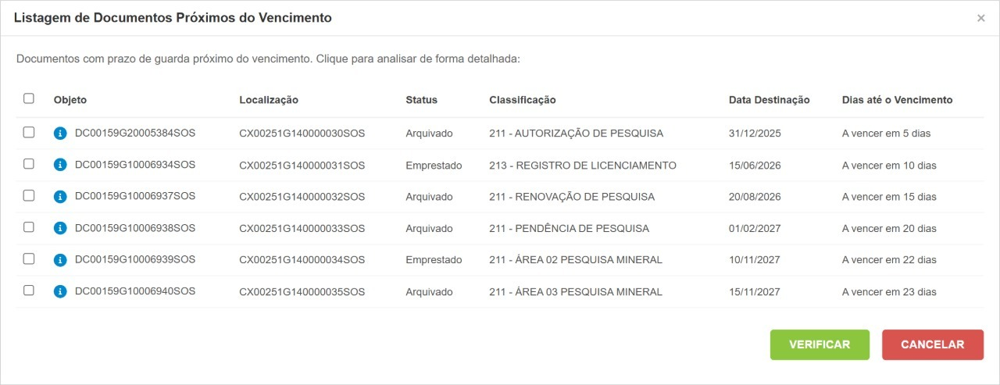

# Controle de prazos e destinações

A funcionalidade **Controle de Prazos e Destinações** permite acompanhar documentos que possuem prazo de guarda definido na Tabela de Temporalidade e executar ações relacionadas à sua destinação documental.

Por meio desta tela é possível:

* Identificar documentos com prazo de guarda próximo do vencimento ou já vencido;
* Solicitar a eliminação de documentos por meio de Ordem de Serviço (O.S.) de Expurgo;
* Solicitar o recolhimento de documentos classificados como Guarda Permanente;
* Recalcular o prazo de guarda dos documentos quando necessário;
* Acompanhar informações de classificação, sigilo e situação documental.


**Requisitos de Acesso**

Para acessar esta funcionalidade é necessário:

* Possuir a permissão **Monitorar Prazo de Guarda** ou **Administrador**;
* Ter o parâmetro **Notificar Prazo de Guarda a Vencer** habilitado no projeto.

Sem essas configurações, a funcionalidade não será disponibilizada ao usuário.


<figure><figcaption></figcaption></figure>

#### Aplicando filtros para pesquisa e emissão de relatórios



No campo Projeto, selecione o projeto que deseja consultar.



Caso deseje localizar um documento específico, informe seu código no campo **Identificador SOS**.



No campo **Destinação Final**, selecione a destinação documental que deseja analisar.



Em **Controle de Prazos de Guarda**, escolha a situação do prazo de guarda dos documentos que deseja visualizar.

As opções disponíveis podem incluir:

* A vencer em 30 dias;
* A vencer em 60 dias;
* A vencer em 90 dias;
* Prazo vencido.

Esse filtro auxilia na identificação de documentos que podem necessitar de reavaliação, eliminação ou recolhimento.



Se necessário, selecione uma **Classificação** para restringir a pesquisa a uma classificação documental específica.



Após preencher os filtros desejados, clique em **Aplicar Filtros** para exibir os resultados correspondentes aos critérios informados.



O sistema deve exibir na **grade de resultados** os documentos que atendem aos critérios informados.



#### Gerenciar Destinações

A ação **Gerenciar Destinações** permite iniciar processos de destinação documental para os documentos selecionados na listagem.

O comportamento da funcionalidade varia conforme a destinação final definida para os documentos.

<table data-card-size="large" data-view="cards"><thead><tr><th></th></tr></thead><tbody><tr><td><h4>Eliminação Documental</h4>
Quando a destinação final do documento for <strong>Eliminação</strong>, o sistema não realiza a exclusão imediatamente.

Ao selecionar os documentos desejados e clicar em <strong>Gerenciar Destinações</strong>:
<ol><li>O usuário é direcionado para o Carrinho de Solicitação.</li><li>É criada uma solicitação para abertura de uma Ordem de Serviço de Expurgo.</li><li>Após o envio da solicitação, o sistema solicita confirmação da operação.</li><li>A eliminação efetiva ocorrerá somente após a execução da O.S.</li></ol>

<strong>Importante</strong>

A eliminação é realizada de forma controlada e rastreável, mantendo o histórico das ações executadas.

Após a conclusão da Ordem de Serviço, os documentos terão seu status atualizado para <strong>Expurgado</strong>.

  
</td></tr><tr><td><h4>Recolhimento de Guarda Permanente</h4>
Quando a destinação final selecionada for <strong>Guarda Permanente</strong>, o botão <strong>Gerenciar Destinações</strong> permite iniciar uma solicitação de recolhimento documental.

Ao executar a ação:
<ol><li>Selecione os documentos desejados.</li><li>Clique em <strong>Gerenciar Destinações</strong>.</li><li>O sistema abrirá o Carrinho de Solicitação.</li><li>O tipo de solicitação será definido automaticamente como <strong>Recolhimento</strong>.</li></ol>

<strong>Recolher ao RDC-Arq</strong>

Durante a criação da solicitação, estará disponível a opção:

<strong>Recolher ao RDC-Arq?</strong>

Quando marcada, o sistema poderá atualizar automaticamente a etapa documental dos objetos após a conclusão da Ordem de Serviço, conforme as configurações definidas para o projeto.

</td></tr></tbody></table>

#### Ações e Regras de Destinação Documental

<strong>Alerta de Documentos Próximos do Vencimento</strong>

Ao acessar o sistema, usuários autorizados podem receber uma notificação automática em tela informando a existência de documentos com prazo de guarda próximo do vencimento, permitindo a adoção das medidas necessárias para avaliação, prorrogação ou destinação documental.

O objetivo é apoiar a gestão do ciclo de vida dos documentos, reduzir riscos de perda de prazo e facilitar o planejamento das atividades de destinação documental.


#### Permissões Necessárias

A funcionalidade está disponível para usuários que possuam uma das seguintes permissões:

* **Executar Destinação Documental**
* **Administrador**


### Como funciona

Durante o login no sistema, o DocZ verifica automaticamente:

* Se o usuário possui permissão para executar atividades de destinação documental;
* Se o projeto possui a notificação de vencimento habilitada;
* Se existem documentos elegíveis para exibição do alerta.

Quando todas as condições forem atendidas, o sistema exibirá uma janela contendo os documentos que estão próximos do vencimento do prazo de guarda.

A partir dessa tela, o usuário poderá:

* Consultar os documentos sinalizados;
* Verificar informações relevantes para análise;
* Acessar diretamente a funcionalidade de Monitoramento de Prazo de Guarda.

### Informações apresentadas no alerta

Para cada documento listado, o sistema poderá exibir informações como:

* Identificador do objeto;
* Localização;
* Status;
* Código de classificação;
* Assunto;
* Destinação final;
* Data de destinação;
* Dias restantes para vencimento.

### Botões disponíveis

<table data-card-size="large" data-view="cards"><thead><tr><th></th></tr></thead><tbody><tr><td><h4>Verificar</h4>
Fecha a notificação e direciona o usuário para a tela de <strong>Monitoramento de Prazo de Guarda</strong>, exibindo os documentos selecionados para análise detalhada.
</td></tr><tr><td><h4>Cancelar</h4>
Fecha a notificação sem realizar redirecionamento para outra tela.
</td></tr></tbody></table>

### Critérios para exibição

O alerta considera apenas documentos que:

* Possuam prazo de guarda calculado automaticamente;
* Possuam data de destinação definida;
* Tenham destinação final configurada como eliminação;
* Estejam dentro do intervalo de alerta configurado no projeto;
* Não estejam em situações que impeçam a destinação documental.

### [Configuração do Projeto](../projetos/como-cadastrar-e-editar-projetos..md#explorando-o-formulario)

A exibição do alerta depende da configuração do parâmetro:

**Notificar Prazo de Guarda a Vencer**

Esse parâmetro permite definir quantos dias antes do vencimento o sistema deverá alertar os usuários.

É possível informar múltiplos intervalos utilizando ponto e vírgula (;).

**Exemplos**

<table><thead><tr><th width="144.33331298828125">Configuração</th><th>Resultado</th></tr></thead><tbody><tr><td>30</td><td>Notificação 30 dias antes do vencimento.</td></tr><tr><td>60;30</td><td>Notificações 60 e 30 dias antes do vencimento.</td></tr><tr><td>90;60;30</td><td>Notificações 90, 60 e 30 dias antes do vencimento.</td></tr></tbody></table>

<strong>Validação de Sigilo</strong>

Ao iniciar uma solicitação de recolhimento, o sistema verifica o nível de sigilo associado aos documentos selecionados.

Caso seja identificado algum documento classificado como:

* Restrito;
* Confidencial;
* Reservado;
* Sigiloso;
* Secreto;
* Ultrassecreto;

o sistema exibirá o alerta:


**ATENÇÃO AO SIGILO**

Esse aviso tem como objetivo alertar o usuário antes da continuidade do processo de recolhimento.


<strong>Recalcular Prazo de Guarda</strong>

A funcionalidade **Recalcular Prazo de Guarda** permite atualizar a data de destinação de documentos sem alterar indevidamente outros metadados.

Esta ação pode ser utilizada quando houver necessidade de:

* Alterar a classificação documental;
* Acrescentar prazo adicional de guarda;
* Atualizar a data de destinação conforme novas regras documentais.

#### Como recalcular o prazo

1. Selecione um ou mais documentos elegíveis.
2. Clique em **Recalcular Prazo**.
3. Na tela apresentada, realize as alterações necessárias:
   * Classificação documental;
   * Prazo Adicional de Guarda.
4. Informe obrigatoriamente uma justificativa.
5. Confirme a operação.

Após a confirmação, o sistema recalculará automaticamente a data de destinação.

<strong>Prazo Adicional de Guarda</strong>

O campo **Prazo Adicional de Guarda** permite acrescentar anos ao prazo vigente do documento.

**Exemplo**

| Situação                  | Valor      |
| ------------------------- | ---------- |
| Data de Destinação Atual  | 15/03/2025 |
| Prazo Adicional de Guarda | 2 anos     |
| Nova Data de Destinação   | 15/03/2027 |

O campo aceita apenas números inteiros positivos.

**Restrições**

O recálculo de prazo não pode ser realizado para documentos:

* Eliminados;
* Recolhidos para guarda permanente;
* Que possuam processo de destinação em andamento;
* Sem classificação válida na Tabela de Temporalidade.

<strong>Registro em Auditoria</strong>

Todas as operações executadas na funcionalidade são registradas na trilha de auditoria do sistema, incluindo:

* Usuário responsável;
* Data e hora da operação;
* Documento afetado;
* Alterações realizadas;
* Justificativa informada;
* Projeto e cliente relacionados.

Esses registros garantem rastreabilidade e conformidade com os requisitos do e-ARQ Brasil.

<a href="./" class="button secondary" data-icon="circle-left">Voltar</a>
