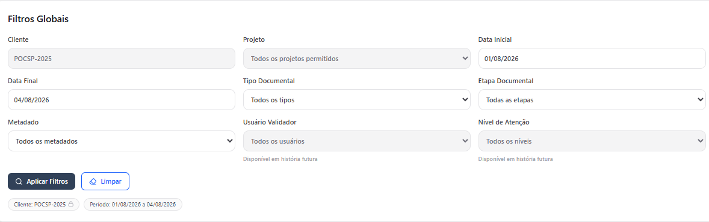

# Dashboard Indexação por IA

O **Dashboard de Indexação por IA** é um painel gerencial que permite acompanhar a qualidade da indexação realizada por Inteligência Artificial e validada pelos usuários.

Os indicadores apresentados são calculados a partir das validações humanas realizadas sobre os metadados extraídos pela IA, permitindo avaliar a assertividade da extração, identificar divergências e acompanhar a evolução da qualidade da indexação.


O painel possui **finalidade exclusivamente analítica** e não realiza qualquer ajuste automático no modelo de IA.


<figure><figcaption></figcaption></figure>

#### **Acesse: Menu → Gestão Documental → Dashboard Indexação por IA**

O painel será exibido considerando automaticamente:

* o cliente vinculado ao usuário;
* os projetos aos quais ele possui acesso;
* o período compreendido entre o primeiro dia do mês atual e a data da consulta.

### Filtros disponíveis

Antes de analisar os indicadores, é possível restringir os dados exibidos utilizando os filtros do painel.

<figure><figcaption></figcaption></figure>

Os filtros disponíveis são:

<table><thead><tr><th width="131.7777099609375">Filtro</th><th>Descrição</th></tr></thead><tbody><tr><td><strong>Cliente</strong></td><td>Define para qual cliente os indicadores serão exibidos. Usuários com acesso a apenas um cliente visualizarão esse campo preenchido e bloqueado automaticamente. Administradores poderão selecionar outros clientes conforme suas permissões.</td></tr><tr><td><strong>Projeto</strong></td><td>Permite restringir os indicadores a um projeto específico ou visualizar os dados consolidados de todos os projetos aos quais o usuário possui acesso. Apenas projetos autorizados são exibidos na lista.</td></tr><tr><td><strong>Período</strong></td><td>Define o intervalo de datas utilizado para calcular os indicadores do painel. A consulta considera a data de conclusão da validação dos documentos. Por padrão, o período corresponde do primeiro dia do mês atual até a data da consulta.</td></tr><tr><td><strong>Tipo Documental</strong></td><td>Filtra os indicadores por um tipo documental específico, permitindo analisar a qualidade da indexação apenas para determinada categoria de documentos, como contratos, prontuários, processos ou outros tipos cadastrados no projeto.</td></tr><tr><td><strong>Etapa Documental</strong></td><td>Restringe os indicadores conforme a etapa documental selecionada. Nesta versão, o filtro é preenchido, por padrão, com <strong>Validado por Humano</strong>, exibindo apenas documentos cuja validação humana foi concluída.</td></tr><tr><td><strong>Metadado</strong></td><td>Permite analisar os indicadores de um metadado específico, como CPF, Nome, Data, Número do Processo ou qualquer outro campo configurado no projeto. Esse filtro facilita a identificação de quais informações apresentam maior assertividade ou maior necessidade de correção durante a validação.</td></tr></tbody></table>

> _Nesta versão da funcionalidade, os campos **Usuário Validador** e **Nível de Atenção** estão presentes apenas para composição da interface e ainda não influenciam os resultados da consulta._

Após selecionar os filtros desejados:

* clique em **Aplicar Filtros** para atualizar os indicadores;
* clique em **Limpar** para restaurar os filtros padrão.

## Indicadores do painel

O Dashboard organiza as informações em quatro grupos principais.

<figure><figcaption></figcaption></figure>




<figure><figcaption></figcaption></figure>

**Volumetria Analisada**

Apresenta o volume de documentos processados no período selecionado.

São exibidos:

* **Documentos Validados:** quantidade de documentos cuja validação foi concluída.
* **Campos Avaliados:** total de metadados avaliados durante a validação.
* **Média por Documento:** média de campos analisados em cada documento.




<figure><figcaption></figcaption></figure>

**Resultado da IA**

Mostra como os dados sugeridos pela Inteligência Artificial foram tratados durante a validação humana.

Os indicadores são:

* **Mantidos Conforme IA:** Representa os campos em que a IA sugeriu um valor e o usuário confirmou exatamente essa informação.
* **Corrigidos:** Representa os campos em que a IA sugeriu um valor, mas o usuário realizou alguma alteração antes da confirmação.






<figure><figcaption></figcaption></figure>

**Índices Consolidados**

Apresenta os indicadores gerais de desempenho da IA.

**Assertividade Média:** Indica o percentual de campos que foram aceitos exatamente como sugeridos pela Inteligência Artificial.

Quanto maior esse índice, maior a qualidade da extração automática.

**Divergência:** Indica o percentual de campos que exigiram intervenção humana.

São considerados divergentes os campos:

* corrigidos;
* preenchidos manualmente;
* que permaneceram vazios por serem opcionais.

Os indicadores de Assertividade e Divergência são complementares e totalizam aproximadamente 100%.




<figure><figcaption></figcaption></figure>

**Campos não Extraídos**

Apresenta informações sobre campos que não foram preenchidos automaticamente pela IA.

Os indicadores disponíveis são:

* **Preenchidos Manualmente:** Campos em que a IA não apresentou sugestão e o usuário realizou o preenchimento.
* **Permaneceram Ausentes:** Campos opcionais que permaneceram sem preenchimento após a validação.



## Abas do painel

<figure><figcaption></figcaption></figure>

O Dashboard está organizado em diferentes abas, cada uma voltada para uma análise específica da qualidade dos dados e do processo de indexação.

<strong>Visão Geral</strong>

**Quando utilizar: para acompanhar os indicadores consolidados do projeto.**

Apresenta um panorama consolidado dos indicadores do projeto, permitindo acompanhar o desempenho geral da indexação, a quantidade de documentos analisados, a taxa de acertos, erros e demais métricas disponíveis. É a principal tela para monitoramento da qualidade dos documentos processados.

<figure><figcaption></figcaption></figure>

<strong>Por Metadado</strong>

**Quando utilizar: para identificar quais campos apresentam maior índice de erros ou inconsistências.**

Exibe os indicadores individualmente para cada metadado configurado no projeto. Essa visão permite identificar quais campos apresentam maior índice de acerto, inconsistências ou necessidade de revisão, facilitando ações de melhoria na indexação.

<figure><figcaption></figcaption></figure>

<strong>Por Usuário</strong>

**Quando utilizar: para avaliar o desempenho dos usuários responsáveis pela indexação e validação.**

Apresenta os indicadores agrupados por usuário responsável pela indexação ou validação dos documentos. Permite acompanhar o desempenho individual da equipe, identificar necessidades de treinamento e monitorar a produtividade dos operadores.

<figure><figcaption></figcaption></figure>

<strong>Campos Ausentes</strong>

**Quando utilizar: para localizar documentos com informações obrigatórias não preenchidas e direcionar ações de correção.**

Lista os metadados obrigatórios que não foram preenchidos durante a indexação dos documentos. Essa aba auxilia na identificação de informações faltantes, contribuindo para a melhoria da qualidade dos cadastros e para a integridade das informações armazenadas no sistema.

<figure><figcaption></figcaption></figure>

## Mais informações:

Atualização dos indicadores

O cabeçalho do painel informa a data e a hora da última atualização dos indicadores.

Sempre que os filtros forem alterados, os cards são recalculados com base nos critérios informados.

Ausência de dados

Caso não existam registros para os filtros selecionados:

* os indicadores de quantidade serão exibidos com valor **0**;
* indicadores percentuais sem base de cálculo serão apresentados como **—**;
* será exibida a mensagem:

> **Não foram localizados dados de validação para os filtros informados.**

Conceitos importantes

<table data-view="cards"><thead><tr><th>Indicador</th><th>Significado</th></tr></thead><tbody><tr><td><strong>Documentos Validados</strong></td><td>Quantidade de documentos que tiveram sua validação concluída.</td></tr><tr><td><strong>Campos Avaliados</strong></td><td>Total de metadados analisados durante a validação humana.</td></tr><tr><td><strong>Mantidos Conforme IA</strong></td><td>Campos aceitos exatamente como sugeridos pela IA.</td></tr><tr><td><strong>Corrigidos</strong></td><td>Campos cujo valor sugerido pela IA foi alterado pelo usuário.</td></tr><tr><td><strong>Preenchidos Manualmente</strong></td><td>Campos sem sugestão da IA que foram preenchidos pelo usuário.</td></tr><tr><td><strong>Permaneceram Ausentes</strong></td><td>Campos opcionais que permaneceram sem valor após a validação.</td></tr><tr><td><strong>Assertividade</strong></td><td>Percentual de campos aceitos conforme a sugestão da IA.</td></tr><tr><td><strong>Divergência</strong></td><td>Percentual de campos que exigiram intervenção humana.</td></tr></tbody></table>

<a href="./" class="button secondary" data-icon="circle-left">Voltar</a>
