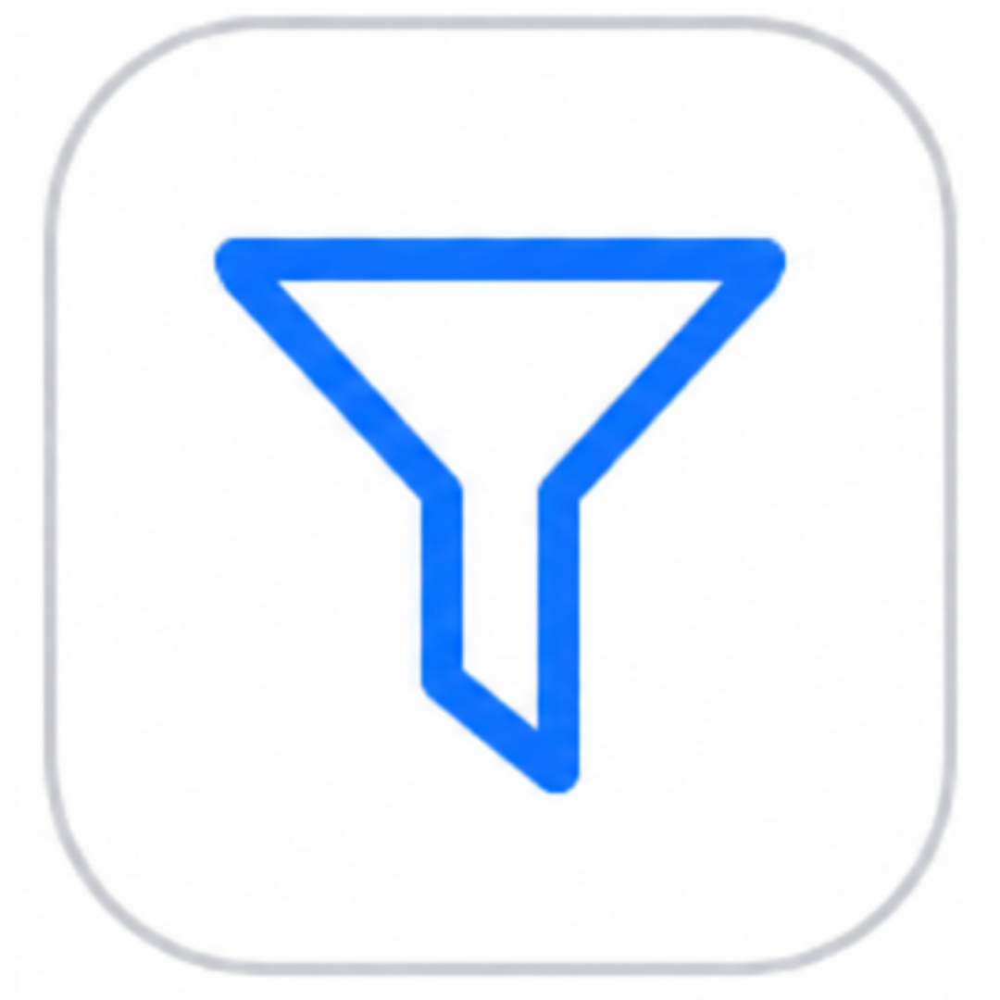
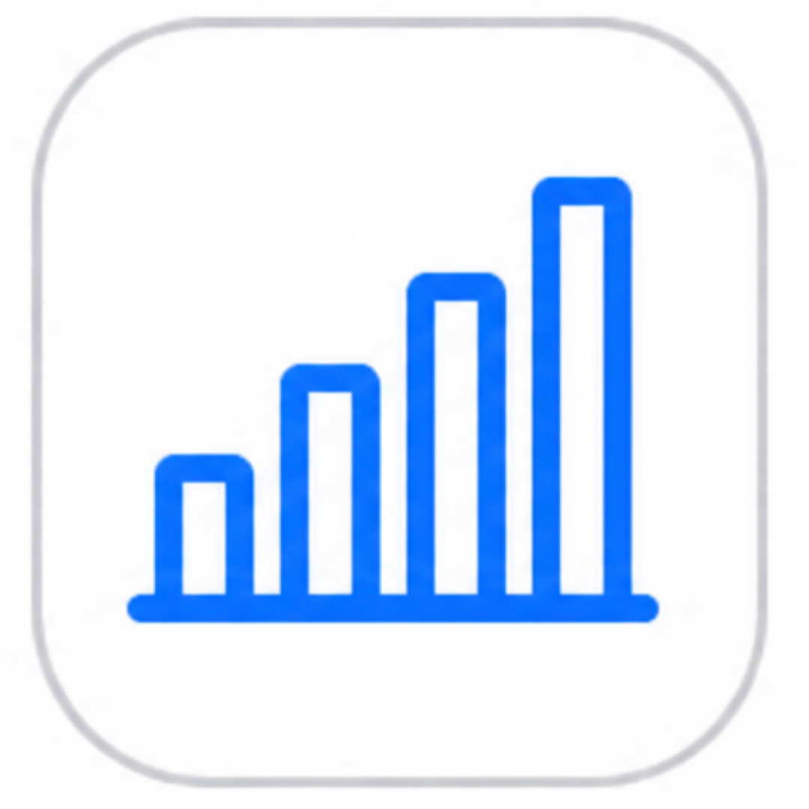

# PAINEL

##  Barra superior

Antes de explorarmos o painel principal, observe a barra superior — ela está sempre visível no topo da tela.\
Nela, você confere o nome do projeto ativo, acessa o menu de usuário, notificações e opções adicionais.

<figure><figcaption></figcaption></figure>

Campo de texto estático que exibe o **nome do cliente** vinculada ao sistema, também conhecido como **alias**.

É o mesmo nome informado no **campo “Cliente”** da **tela de login**.

Essa informação é utilizada para **identificação visual e organizacional**, facilitando o reconhecimento do ambiente de uso.

Exibe o **código de guarda do projeto** em conjunto com o **nome do projeto selecionado** dentro do cliente.


**Atenção:** Um mesmo cliente pode ter **mais de um projeto cadastrado**. É necessário **selecionar o projeto antes de iniciar o uso do sistema**, pois, sem essa seleção prévia, **as funcionalidades da tela de pesquisa podem não funcionar corretamente**.


Essa visualização facilita a **identificação rápida e precisa** do projeto ativo no ambiente.

Neste botão será exibido o nome do usuário atualmente logado.\
Ao clicar, o sistema direcionará para a tela **"Minha Conta"**, onde será possível **alterar ou atualizar a senha**, além de **adicionar ou remover o certificado digital**.

<figure><figcaption></figcaption></figure>

 <strong>Logout</strong>

Botão identificado por um **ícone de saída**, que permite ao usuário **encerrar sua sessão** e **sair do sistema de forma segura**.


**Segurança:** O sistema utiliza a tecnologia _keep alive_, garantindo que a sessão permaneça ativa enquanto o usuário estiver utilizando o DocZ. Caso a aba seja fechada sem logout, o sistema realiza o encerramento automático após 3 minutos.

<mark style="color:$info;">Essa funcionalidade segue as melhores práticas de segurança da informação, garantindo proteção de dados e integridade das sessões de usuário.</mark>


 <strong>Acesso ao manual DocZ</strong>

Ao clicar neste ícone, o usuário é direcionado para o **manual do sistema**, que reúne instruções detalhadas sobre as funcionalidades da plataforma.

Na página do manual, é possível **navegar entre as seções** utilizando o menu lateral ou **pesquisar por palavra-chave** no campo de busca localizado acima do menu.


Como alternativa, o usuário pode **acessar o campo de busca** de forma rápida por meio do **atalho de teclado `Ctrl + K`**, agilizando a localização de conteúdos e instruções específicas.


<figure><figcaption></figcaption></figure>

 <strong>Central de Notificações</strong>

A Central de Notificações do DocZ permite que os usuários acompanhem avisos, alertas operacionais e comunicados importantes diretamente pela plataforma.

A funcionalidade disponibiliza um ícone de notificações na barra superior do sistema, indicando a existência de novos eventos ou notificações pendentes de visualização.

#### Recursos disponíveis

* Ícone de notificações com indicação visual de novos avisos;
* Centralização de comunicados e eventos importantes do sistema, conforme as permissões do usuário autenticado;
* Visualização de notificações operacionais e institucionais;
* Acompanhamento facilitado de pendências, alertas e atualizações relevantes.

<figure><figcaption></figcaption></figure>

 <strong>Componentes</strong>

Os links abaixo permitem baixar os aplicativos utilizados pelo Grupo SOSDocs:

* [**DocZ Android**](aplicativos/app-docz.md) – leve o acesso ao DocZ para a palma da mão. Disponível para sistemas Android, o aplicativo é amplamente utilizado pela operação para gerenciar armazenamento e localização dos objetos cadastrados no sistema.
* [**EtiqPress**](aplicativos/etiqpress.md) – aplicativo desktop integrado ao DocZ para criar, imprimir e gerenciar etiquetas com dados automáticos como ID SOS e código de localização. Permite gerar etiquetas de caixas, documentos e endereçamento de forma rápida e precisa.

<figure><figcaption></figcaption></figure>

###  Notificações ao acessar

 <strong>Release Notes</strong>

Ao realizar login no sistema, é exibida uma **janela pop-up automática** apresentando as **últimas atualizações**, **melhorias**, **correções** e **novidades da versão atual** do **DocZ**.

Essa funcionalidade mantém o usuário **informado sobre as mudanças recentes**, garantindo **transparência** e **atualização contínua** quanto às evoluções do sistema.


**Fique atento:** para habilitar qualquer nova funcionalidade em um projeto específico, **entre em** **contato com o suporte do Grupo SOSDocs**.


<figure><figcaption></figcaption></figure>

 <strong>Lotes Pendentes de Aprovação</strong>

Usuários que possuem a permissão **“Avaliador de Lotes”** agora recebem um **alerta em pop-up** ao acessar o sistema, sempre que existirem lotes com o status **“Aguardando Aprovação”**.

A notificação é exibida automaticamente e oferece um **atalho direto** para a funcionalidade de **avaliação de lotes**, facilitando o acompanhamento e a tomada de decisão.

> **Importante:** Essa funcionalidade requer **parametrização específica de permissões**.\
> Para ativá-la, entre em contato com o **suporte do Grupo SOSDocs** ou com o **gerente do projeto** responsável.

###  **Área de Filtros (topo da tela)**

<figure><figcaption></figcaption></figure>

Utilize os filtros para visualizar estatísticas de solicitações com base em:

* **Projeto**: selecione o projeto desejado
* **Unidade**: escolha a unidade da sua instituição
* **Data Inicial e Final**: defina o período para consulta


**Importante**: Os filtros de data afetam apenas as estatísticas de solicitações, como indicado na tela.


##  Gráficos do Painel Inicial

Assim que você acessa o sistema, é direcionado ao Painel Inicial do DocZ.\
Ele apresenta um **resumo visual** das atividades, permitindo acompanhar o desempenho do contrato de forma simples e intuitiva.

<figure><figcaption></figcaption></figure>

### Tipos de Gráficos Disponíveis

Os dados são exibidos em dois formatos principais de visualização:

* 🟣 **Gráfico de Pizza**: apresenta os dados em **percentuais**, facilitando a comparação proporcional entre categorias.
* 📊 **Gráfico de Barras**: exibe o **volume total** dos dados por categoria, ideal para análises comparativas diretas.

📦 <strong>Caixas e Documentos</strong>

Apresenta o número de documentos e caixas cadastrados

<figure><figcaption></figcaption></figure>

📝 <strong>Tipo de Solicitação</strong>

Mostra tipos como guarda, digitalização, devolução, entre outros.

<figure><figcaption></figcaption></figure>

⏳ <strong>Status da Solicitação</strong>

Exibe o andamento das solicitações — _Em andamento_, _Em atendimento_, _Finalizada_ ou _Cancelada_.

<figure><figcaption></figcaption></figure>

🚦<strong>Prioridade da Solicitação</strong>

Apresenta a quantidade de solicitações de acordo com o nível de prioridade — Normal ou Urgente.\
&#x20;_<mark style="color:blue;">Use essa informação para acompanhar o volume e a criticidade das demandas.</mark>_

<figure><figcaption></figcaption></figure>

🗃️ <strong>Gestão Documental – Caixas</strong>

Exibe o tipo, volume e percentual de caixas envolvidas na atividade.

<figure><figcaption></figcaption></figure>

📁 <strong>Gestão Documental – Documentos</strong>

Exibe o tipo, volume e percentual de documentos envolvidos na atividade.

<figure><figcaption></figcaption></figure>

⛔ <strong>Status do Objeto</strong>

Indica a situação atual dos itens armazenad**os** — _Arquivado_, _Em tratamento_, _Não implantado_, _Solicitado_, entre outros.

<figure><figcaption></figcaption></figure>

📚 <strong>Tipo de Objeto</strong>

Categoriza os itens por tipo — _documentos_, _mídias_, _livros_, _tipos documentais_, etc.

<figure><figcaption></figcaption></figure>

🏢 <strong>Caixas/ Documentos por Departamento</strong>

Exibe **quantas caixas e documentos** cada **setor da instituição** possui.


_&#x4F;_&#x73; setores precisam estar **parametrizados no sistema** para a visualização correta dos dados.

_Em caso de dúvidas, entre em contato com o **Suporte** ou o **Gestor de Projeto do Grupo SOS Docs**._


<figure><figcaption></figcaption></figure>


_Os gráficos são atualizados conforme os dados inseridos e os filtros aplicados (data, unidade, projeto)._


##  Menu lateral esquerdo 

O menu lateral é o ponto de partida para acessar as principais funcionalidades do DocZ. Cada item leva você a uma área específica do sistema, como Painel, Projetos, Pesquisar, Solicitações e muito mais.

<table data-view="cards"><thead><tr><th></th><th data-hidden data-card-cover data-type="image">Cover image</th></tr></thead><tbody><tr><td>
 

Permite localizar caixas ou documentos pelos metadados.

<mark style="color:$warning;">🛈 Os campos buscáveis podem ser configurados, adaptando a busca às necessidades do cliente.</mark>
</td><td></td></tr><tr><td>
 

Fornece visão geral do sistema, incluindo indicadores, gráficos e atalhos para atividades frequentes. 
</td><td></td></tr><tr><td>  Redireciona o usuário logado diretamente para o ambiente SmartDocs sem novo login. <mark style="color:$warning;">🛈 Requer permissão específica e acesso aos dois sistemas.</mark> </td><td></td></tr><tr><td>  Exibe os projetos do cliente, permitindo selecionar, criar, editar, definir parâmetros de acesso, SLA e outras configurações.  </td><td></td></tr><tr><td>  Pesquisa objetos, gerencia filtros e metadados, formulários de busca, relatórios e o banco de dados.  </td><td></td></tr><tr><td>  Controle do espaço ocupado por cliente e projeto. Permite emissão de relatórios detalhados de governança. <mark style="color:$warning;">🛈 Permissão exclusivo para administradores.</mark></td><td></td></tr><tr><td>  Gerencia e controla as ordens de serviço (O.S.), permitindo visualizar e atender solicitações. </td><td></td></tr><tr><td>  Área administrativa para ajustes e personalizações do sistema. <mark style="color:$warning;">🛈 Permissão exclusivo para administradores.</mark></td><td></td></tr><tr><td>  Permite importar metadados em massa sobre os objetos do projeto.  </td><td></td></tr><tr><td>  Criação, edição e gerenciamento de usuários e grupos do sistema. <mark style="color:$warning;">🛈 Permissão exclusivo para administradores.</mark></td><td></td></tr><tr><td>  Cadastro e gerenciamento de clientes e contratos. <mark style="color:$warning;">🛈 Permissão exclusivo para administradores.</mark> </td><td></td></tr><tr><td>  Permite gerenciar o tratamento documental, distribuir atividades, cadastrar instrumentos arquivísticos e gerenciar digitalizações.</td><td></td></tr><tr><td>  Gerencia informações de transporte, incluindo cadastro e acompanhamento de veículos e serviços.</td><td></td></tr><tr><td>  Gerencia armazéns e o armazenamento dos objetos dos clientes, incluindo recursos para arquivamento e localização.</td><td></td></tr><tr><td>  Permite realizar trilhas de auditoria e gerenciar reimpressões de etiquetas pelo EtiqPress. </td><td></td></tr><tr><td>  Geração e exportação de relatórios e indicadores para análise ou prestação de contas.</td><td></td></tr></tbody></table>

##  **Suporte** 

O botão **SUPORTE** está disponível em todas as páginas do sistema, localizado no canto inferior direito da tela. Por meio dele, é possível registrar dúvidas, incidentes ou solicitações relacionadas à utilização do DocZ, como localização de caixas, alteração de status, dificuldades operacionais, entre outros atendimentos.

<figure><figcaption></figcaption></figure>

### Como solicitar suporte?


Para garantir maior agilidade, organização e rastreabilidade no atendimento, recomenda-se utilizar sempre o botão **SUPORTE** disponível dentro do sistema. Esse é o canal oficial para registro e acompanhamento de chamados.

Solicitações enviadas diretamente por e-mail podem dificultar o controle e o acompanhamento das demandas. Por isso, o uso da central de suporte permite um atendimento mais eficiente, seguro e estruturado.




Clique no botão  disponível na tela;



Será exibida uma janela de atendimento;

<figure><figcaption></figcaption></figure>




Informe palavras-chave relacionadas à sua solicitação, como “caixa”, “status”, “movimentação” etc.;

<figure><figcaption></figcaption></figure>




Selecione a opção correspondente para registrar o chamado;



Ao selecionar a opção desejada, o usuário será direcionado para o formulário de solicitação de suporte, onde deverão ser preenchidas as informações necessárias para abertura do chamado.

**Campos do formulário**

* **Nome do cliente:** informar o nome da instituição ou cliente relacionado à solicitação;
* **Resumo:** preencher com um título breve que identifique de forma objetiva a demanda;
* **Descrição:** detalhar o ocorrido, informando a situação encontrada e a solicitação desejada;
* **Nº da Ordem de Serviço (opcional):** campo destinado ao registro do número da OS vinculada ao chamado, quando aplicável;
* **Anexos (opcional):** permite inserir evidências complementares, como capturas de tela, documentos ou imagens que auxiliem na análise do atendimento;
* **E-mail de contato:** campo obrigatório utilizado para envio das atualizações e acompanhamento do status do chamado.

<figure><figcaption></figcaption></figure>




Após o preenchimento de todos os campos obrigatórios, o usuário deverá clicar no botão   , responsável pelo envio da solicitação de suporte.




Você receberá no e-mail cadastrado o **número do chamado** e poderá acompanhar o andamento.


### Clique aqui para solicitar suporte. 👇 



<a href="./" class="button secondary" data-icon="circle-left">Voltar</a>
