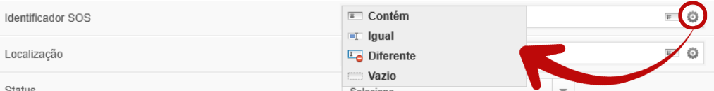

# Responsáveis pelo transporte

Esta tela permite **gerenciar os colaboradores responsáveis pelo transporte**, como motoristas e ajudantes, garantindo controle centralizado, padronização das informações e uso correto desses dados nas operações de transporte.

<figure><figcaption></figcaption></figure>

#### ➕ Cadastrar novo colaborador



No **menu lateral**, acesse:\
**Transporte → Responsáveis pelo Transporte**




Na tela **Responsáveis pelo Transporte**, clique no botão **Novo Colaborador**.

<figure><figcaption></figcaption></figure>



Na primeira etapa, selecione o **tipo de colaborador**:

* **Interno (Usuário SOS)**: colaborador já cadastrado como usuário do sistema.
* **Terceirizado**: colaborador externo à instituição.

<figure><figcaption></figcaption></figure>

👤 Cadastro de colaborador interno (Usuário SOS)

1. Selecione o usuário desejado no campo **Usuário SOS**.
2. Os dados básicos do usuário serão **carregados automaticamente**.
3. Preencha os campos complementares, se necessário.
4. Selecione a **Função no Transporte**:

* Motorista
* Ajudante

<figure><figcaption></figcaption></figure>

👥 Cadastro de colaborador terceirizado

1. Preencha os dados do colaborador:

* Nome (obrigatório)
* CPF (obrigatório)

2. Demais campos conforme disponibilidade
3. Selecione a **Função no Transporte**:

* Motorista
* Ajudante

<figure><figcaption></figcaption></figure>




Clique em  para concluir o cadastro.




Ação concluída


### 🔧 Mais ações disponíveis

<figure><figcaption></figcaption></figure>

✏️ Editar colaborador

1. Na lista de colaboradores, localize o registro desejado.
2. Clique no **ícone de edição** .png>).
3. Altere as informações necessárias.
4. Clique em **Salvar** para atualizar os dados.

🗑️ Excluir colaborador

1. Na lista de colaboradores, localize o registro que deseja excluir.
2. Clique no **ícone** .png>), que representa a ação de exclusão.
3. Confirme a exclusão na mensagem exibida.


Após a confirmação, o colaborador será removido do cadastro.


🔍 Buscar colaborador

<figure><figcaption></figcaption></figure>

Na parte inferior da tela, utilize o campo **Buscar** para localizar rapidamente um colaborador.

É possível pesquisar por:

* Nome do colaborador
* CPF
* Função (Motorista ou Ajudante)

A listagem será filtrada automaticamente conforme o termo informado.

***


### 🔐 Controle de Acesso

O acesso ao cadastro de **Responsáveis pelo Transporte** é restrito a usuários com permissões específicas. Usuários sem essa autorização não visualizam nem acessam a funcionalidade.

Caso seja necessário, o acesso deve ser solicitado ao suporte.


<a href="./" class="button secondary" data-icon="circle-left">Voltar</a>
